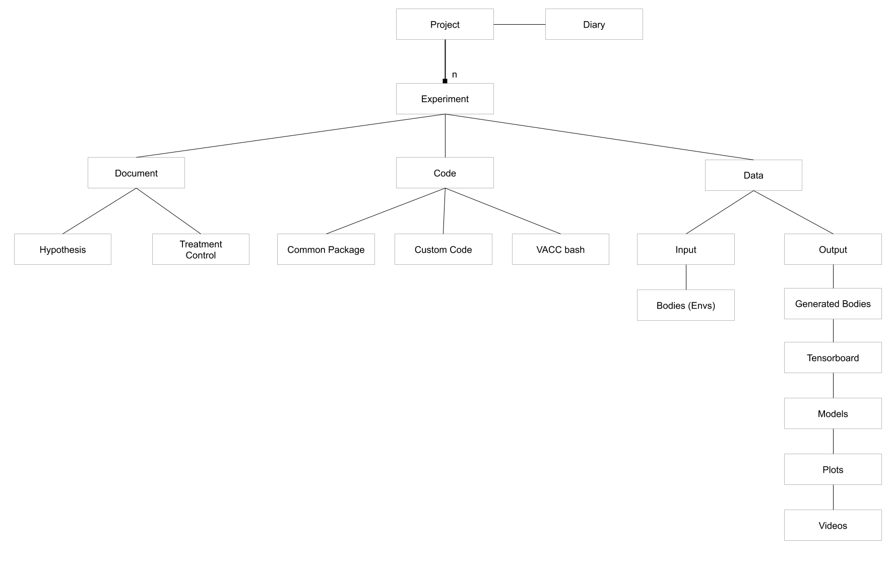

# ResearchProjectFramework
Try to design a better practice.

## Design

1. `output_data` folder will be huge, so keep it in a separate place, so when we copy paste another experiment, we don't need to copy the output data.

2. every experiment need a hypothesis, so we would remember what we are testing.

3. whenever there's a new idea, formulate it as a hypothesis, and copy paste another exp folder for that.

4. `common` package includes all the tools needed. copy that with the exp folder, so we won't mess up the dependencies of earlier experiments.

5. use `start_experiment.sh` to start the experiment, so we know what we executed.

6. commit everything except `output_data` onto github every night when work ends.

